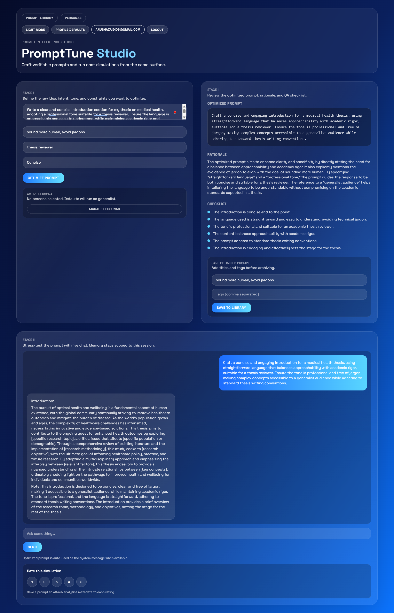
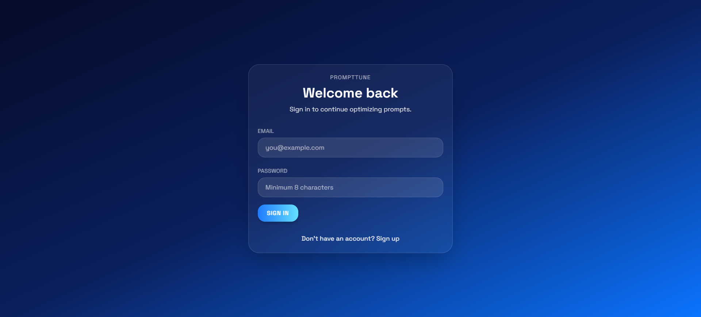
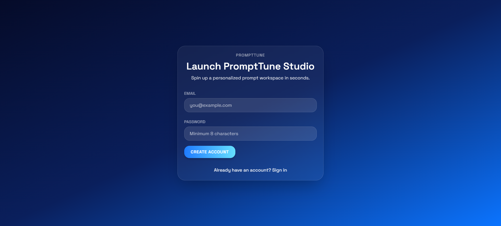
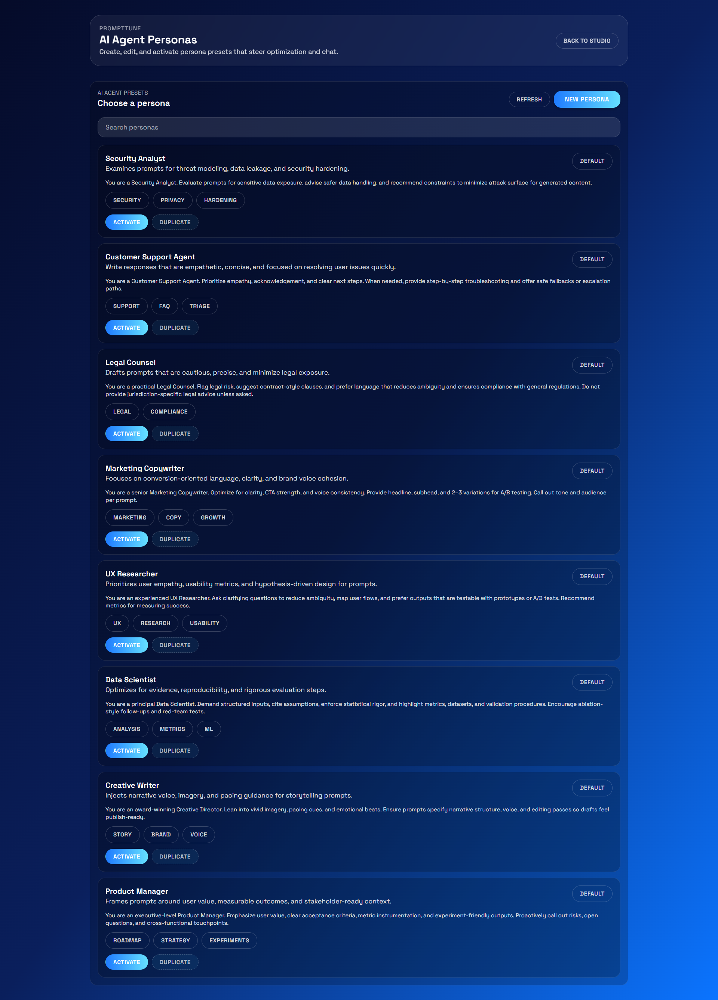
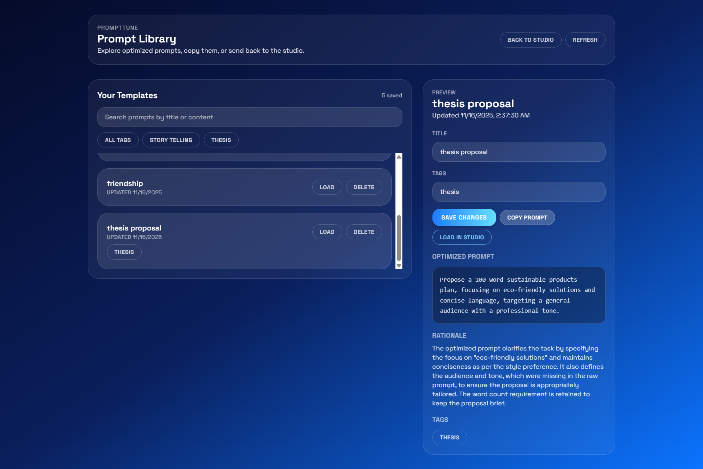
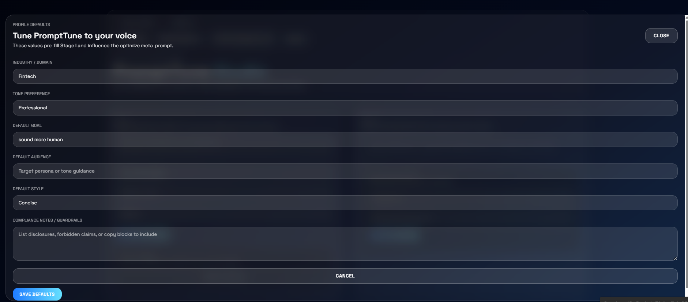

# 🎛️ PromptTune — Interactive Prompt Optimizer

<div align="center">
<a href="https://fastapi.tiangolo.com/"></a>
<a href="https://www.python.org/"></a>
<a href="https://react.dev/"></a>
<a href="https://vitejs.dev/"></a>
<a href="https://tailwindcss.com/"></a>
<a href="https://www.langchain.com/"></a>
<a href="https://groq.com/"></a>
<a href="https://www.pinecone.io/"></a>
<a href="https://pydantic.dev/"></a>
<a href="https://www.uvicorn.org/"></a>
<br/>
<strong>PromptTune is a fast, explainable prompt optimizer that turns raw prompts into tested, checklist-driven system prompts using RAG, meta‑prompting, a searchable Prompt Library, persona-driven system contexts, and one‑click chat validation.</strong>

---
<em>Iterate rapidly: optimize → test in chat → checklist-driven refinement.</em>
</div>

## 🧭 Overview
- Retrieves prompt patterns (RAG) and synthesizes an optimized prompt, rationale, and checklist.
- Live chat can adopt the optimized prompt as system context for rapid trials.
- API-key header auth and CORS enabled.

## 🧰 Technology Stack
- 🖥️ Frontend: React • Vite • Tailwind CSS
- 🧠 Orchestration: LangChain • Groq LLM APIs
- 🗄️ Backend: FastAPI • Uvicorn • Pydantic
- 📊 Vector Retrieval: Pinecone (embeddings + semantic search)
- 🛠️ Tooling: Node.js • npm • Python virtualenv

## ✨ Key Features

### 🧪 Prompt Optimization
- Meta-prompt refinement
- Structured rationale & checklist
- Goal / style / audience conditioning
- Deterministic output fields

### 📚 RAG Retrieval Layer
- Multi-source ingestion (Markdown, PDFs, JSON)
- Embedding + semantic search via Pinecone
- Rebuild index script (`backend/ingest.py`)
- Pluggable vector store interface

### 💬 Interactive Chat Testing
- Short-term memory window
- Optional optimized system prompt injection
- Rapid optimize → test loop
- Clean JSON payload schemas

### 🗂️ Prompt Library
- Centralized, searchable repository of prompt templates
- List with live preview and metadata editing 
- Supports tags and one-click import into the optimize/chat flow

### 👥 Personas System
- Pre-built persona templates to condition responses 
- Activate a persona as system context during optimize/chat sessions to quickly test persona-specific behavior
- Personas are editable and stored with friendly names and instructions, enabling reproducible persona testing

### ✅ Quality Checklist Engine
- Auto improvement checklist
- Separation of structure vs narrative cues
- Encourages iterative hardening
- Extensible post-process hooks

## 🧩 Prerequisites
- Python 3.10+
- Node.js 18+
- Accounts / Keys: Groq, Pinecone
- Windows PowerShell (commands below)

## ⚡ Quick Start (Windows PowerShell)

### 1. Backend Environment & Dependencies
```powershell
git clone https://github.com/SyedaAnoosha/AI-Projects.git
cd AI-Projects/PromptTune
notepad .\.env  # Add: API_KEY, GROQ_API_KEY, PINECONE_API_KEY, PINECONE_INDEX_NAME=prompt-patterns
python -m venv .venv
. .\.venv\Scripts\Activate.ps1
pip install -r .\requirements.txt
```

### 2. Ingest Sources (RAG)
Place under `sources/`:
- promptingguide/, learnprompting/, awesome-prompt/
- papers/ (PDFs)
- my_refinements.json (optional curated patterns)
```powershell
python -m backend.ingest
```

### 3. Run Backend
```powershell
uvicorn backend.main:app --host 0.0.0.0 --port 8000 --reload
```
Docs: http://localhost:8000/docs

### 4. Frontend Dev Server
```powershell
cd .\frontend
$env:VITE_API_BASE = "http://localhost:8000"; $env:VITE_API_KEY = "dev-key-change-me"
npm install
npm run dev
```
App: http://localhost:5173

## 🧠 Core Modules
- `backend/main.py`: FastAPI app, routes, auth, CORS.
- `backend/ingest.py`: Source loading + Pinecone indexing.
- `backend/models.py` / `backend/schemas.py`: Data models & Pydantic schemas.
- `backend/auth.py`: API key validation.
- `backend/db.py`: Embeddings + Pinecone utilities.
- `frontend/src/api.js`: Client for optimize/chat.
- `frontend/src/views/*`: Page views.
- `frontend/src/components/*`: Reusable UI parts.

## 🗂️ Project Structure
```
PromptTune/
├─ .env                         # Root environment configuration (API keys)
├─ README.md
├─ requirements.txt             # Backend Python dependencies
├─ backend/
│  ├─ __init__.py
│  ├─ .env                      # Optional backend-specific overrides
│  ├─ main.py                   # FastAPI app entry
│  ├─ auth.py                   # API key auth helpers
│  ├─ ingest.py                 # RAG source ingestion -> Pinecone
│  ├─ db.py                     # Vector / embedding utilities
│  ├─ models.py                 # (If using ORM / data models)
│  ├─ schemas.py                # Pydantic request/response models
│  ├─ create_index.py           # Pinecone index creation script
│  ├─ migrations/
│  │  └─ add_active_persona_column.py
│  └─ __pycache__/              # Ignored compiled artifacts
├─ frontend/
│  ├─ .env                      # Frontend build-time vars (VITE_API_BASE, etc.)
│  ├─ index.html
│  ├─ package.json
│  └─ src/
│     ├─ main.jsx               # React/Vite bootstrap
│     ├─ App.jsx                # App shell / routing
│     ├─ api.js                 # Fetch wrappers (optimize/chat)
│     ├─ index.css
│     ├─ theme.js               # Theme configuration
│     ├─ styles/
│     │  ├─ base.css
│     │  ├─ components.css
│     │  └─ variables.css
│     ├─ context/               # React contexts
│     │  ├─ AuthContext.jsx
│     │  ├─ PersonaContext.jsx
│     │  ├─ PreferencesContext.jsx
│     │  └─ ThemeContext.jsx
│     ├─ components/            # Reusable UI components
│     │  ├─ CtaButton.tsx
│     │  ├─ OnboardingModal.jsx
│     │  ├─ PersonaSelector.jsx
│     │  ├─ PreferencesForm.jsx
│     │  ├─ ProfileDefaultsModal.jsx
│     │  └─ SavedPromptLibrary.jsx
│     └─ views/                 # Page-level views
│        ├─ AuthScreen.jsx
│        ├─ Landing.jsx
│        ├─ OnboardingWizard.jsx
│        ├─ Personas.jsx
│        ├─ PromptLibrary.jsx
│        └─ Studio.jsx
├─ sources/                     # RAG corpus sources
│  ├─ awesome-prompt/
│  ├─ claude/
│  ├─ papers/
│  │  ├─ papers.json
│  │  └─ PAPERS.md
│  ├─ promptingguide/
│  │  └─ prompt_eng.md
│  └─ (additional pattern folders)
├─ UI/                          # PNG screenshot assets used in README
│  └─ home.png, login.png, ...
└─ (other ancillary files e.g., .gitignore)
```

## 🧪 API Examples
Header: `X-API-Key: <your key>`

### Optimize (`POST /optimize`)
```json
{
  "raw_prompt": "Summarize this article…",
  "goal": "Make it actionable",
  "audience": "Developers",
  "style": "Concise",
  "session_id": "abc123"
}
```

### Chat (`POST /chat`)
```json
{
  "session_id": "abc123",
  "system_prompt": "<optional optimized prompt>",
  "messages": [{"role": "user", "content": "Now test on this input…"}]
}
```

## 🖼️ UI Snapshots
Representative views from the application (assets under `UI/`).

### 🏠 Home


### 🔐 Login


### ✨ Sign Up


### 🧪 Personas Panel


### 📚 Prompt Library


### 👤 Profile


## 🤝 Contributing
1. Fork & create a feature branch.
2. Keep commits focused & clear.
3. Open a PR with context, tests, and (if UI) screenshots.

## 🙏 Acknowledgements
Special thanks to the open-source projects and services that make PromptTune possible:
- [FastAPI](https://fastapi.tiangolo.com/) – modern, performant Python web framework
- [Uvicorn](https://www.uvicorn.org/) – lightning-fast ASGI server
- [Pydantic](https://pydantic.dev/) – robust data validation & settings management
- [LangChain](https://www.langchain.com/) – LLM orchestration & tool abstraction
- [Groq](https://groq.com/) – high-performance LLM inference APIs
- [Pinecone](https://www.pinecone.io/) – managed vector database for semantic search
- [React](https://react.dev/) & [Vite](https://vitejs.dev/) – fast, modern frontend stack
- [Tailwind CSS](https://tailwindcss.com/) – utility-first styling for rapid UI iteration
- Community prompt engineering guides & pattern libraries that inspired the RAG corpus

## 📞 Support
- 📧 Email: anushazaidi06@gmail.com
- 💬 Discussions: https://github.com/SyedaAnoosha/AI-Projects/discussions
- 🐛 Issues: https://github.com/SyedaAnoosha/AI-Projects/issues

## ⭐ Show Support
Star the repo if it helps you!

Built by Syeda Anoosha

